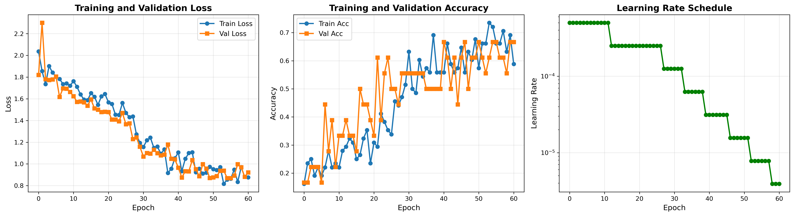
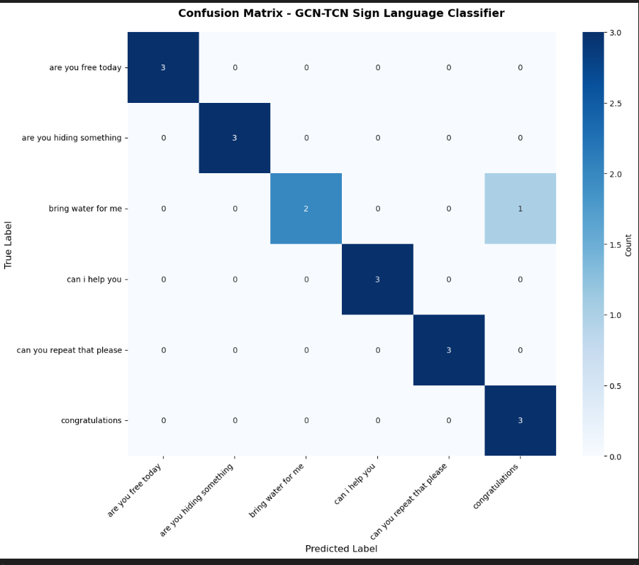

# Continuous Sign Language Recognition using Eigenvalue-Driven GCN-TCN

This project implements a sentence-level sign language recognition pipeline using MediaPipe keypoints and a hybrid Graph Convolutional Network + Temporal Convolutional Network (GCN-TCN).

## Highlights

- Skeleton-based recognition from RGB videos using MediaPipe Holistic landmarks.
- Eigenvalue-based keypoint selection to reduce input from 75 to 35 keypoints.
- Hybrid architecture:
  - Spatial GCN for inter-joint relationship learning.
  - Temporal TCN with dilated convolutions for sequence modeling.
- Best validation accuracy: **94.44%** (best checkpoint at epoch 26).

## Dataset Classes

The current model is trained on 6 sentence classes:

1. are you free today
2. are you hiding something
3. bring water for me
4. can i help you
5. can you repeat that please
6. congratulations

## Repository Contents

- `Main.ipynb`: Main end-to-end notebook for preprocessing, training, and evaluation.
- `best_gcn_tcn_model.pth`: Best trained model checkpoint.
- `gcn_tcn_training_history.png`: Training history curves.
- `confusionmatrix.png`: GCN-TCN confusion matrix.
- `Architecture_Diagram.md`: Detailed architecture and dimension flow.
- `EIGEN_KEYPOINT_GUIDE.md`: Explanation of eigenvalue-driven keypoint selection.

## Model Summary

- Input: MediaPipe landmarks per frame (x, y, z).
- Keypoint reduction: 75 -> 35 (53.3% reduction).
- Spatial modeling: 2-layer GCN.
- Temporal modeling: 4-block dilated TCN.
- Classifier: Fully connected layers with softmax output.

## Key Result

- Validation Accuracy: **0.9444**
- Validation Loss: **0.4398**

## Visual Results

### Training History

### Confusion Matrix

## Tech Stack

- Python
- PyTorch
- MediaPipe
- NumPy
- OpenCV
- scikit-learn
- Matplotlib / Seaborn

## How to Run

1. Open `Main.ipynb`.
2. Install required Python packages used in the notebook.
3. Run cells in order for:
   - keypoint extraction
   - eigenvalue-based feature selection
   - training/evaluation
4. Use `best_gcn_tcn_model.pth` for inference/evaluation.

## Notes

- This repository currently focuses on 6 sentence classes.
- For larger vocabulary and multi-signer generalization, extend the dataset and retrain.
